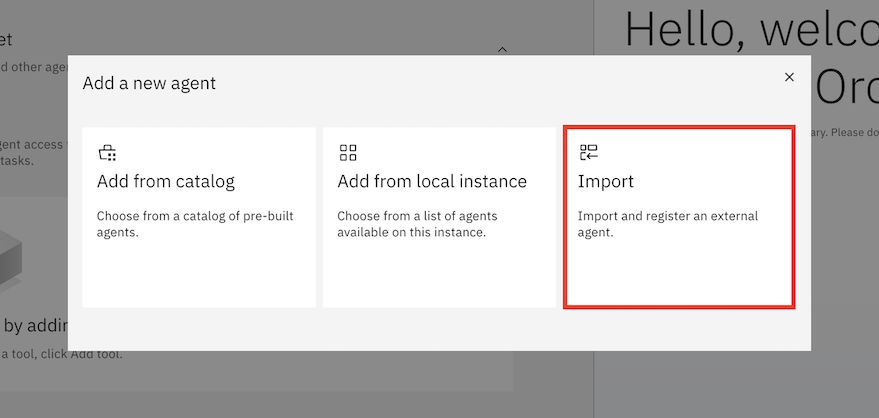

# Kullanım Durumu: Akıllı AI Asistanı

## İçindekiler

- [Kullanım Durumu: Akıllı AI Asistanı](#kullanım-durumu-akıllı-ai-asistanı)
  - [İçindekiler](#i̇çindekiler)
  - [Giriş](#giriş)
    - [Ön koşullar](#ön-koşullar)
  - [watsonx Orchestrate](#watsonx-orchestrate)
    - [watsonx Orchestrate konsolu](#watsonx-orchestrate-konsolu)
    - [AI Agent Yapılandırması](#ai-agent-yapılandırması)
    - [Dock Status Agent](#dock-status-agent)
    - [Surplus Agent](#surplus-agent)
    - [Secretary Agent](#secretary-agent)
    - [Traffic Agent](#traffic-agent)
    - [Warehouse Manager Agent](#warehouse-manager-agent)
  - [Özet](#özet)

## Giriş
Bu kullanım durumu, bir kullanıcının her talebi karşılamak için doğru ajanı seçmek gerektiren görevlerin yürütülmesinde yardımcı olmak üzere sohbet / doğal dil arayüzü aracılığıyla bir AI ajanından yararlandığı bir senaryoyu açıklar.
Ajanlar, organizasyonun özel ihtiyaçlarını karşılamak için sistemde yapılandırılabilir. Verilen açıklamalara dayalı olarak, bu ajanlar eldeki görevi yerine getirmeleri durumunda seçilirler.
Her ajan, sırayla, fonksiyon çağrısını destekleyen bir Büyük Dil Modeli (LLM) ile bağlantılıdır, böylece yine her aracın açıklamasına dayalı olarak bir veya daha fazla aracı kullanabilir.

Senaryomuzda, Dock Status, Surplus Handling, Secretary fonksiyonları ve son olarak Traffic bilgisi için ajanlar oluşturacağız, bunların hepsi son kullanıcıdan gelen istekleri alacak ve daha sonra cevabı döndürmeden önce yürütme için uygun ajanı seçecek olan bir "yönlendirme ajanı"na bağlı olacak. Simüle ettiğimiz etkileşim akışı, bir Warehouse Manager'ın dock durumunu sorduğu, herhangi bir fazla ürünün işlenmesi konusunda önerilerde bulunma isteklerinde bulunduğu, doğru paydaş grubunu bilgilendirdiği ve aynı zamanda depo çevresindeki trafiği göz önünde bulundurduğu bir akıştır.

Gerçekten ajansal bir çözümün yüksek derecede özerklik göstereceği yönünde bir argüman var. Belirli bir problemi veya talebi ele almak için, ajansal bir çözüm bir plan yapar, bu planı yürütür, iyi bir sonuca yönelik etkinliğini kontrol eder ve gerektiğinde planı revize eder, tüm bunları otomatik bir şekilde ve insan müdahalesi olmadan yapar. Bunu yukarıda açıklanan akışa uygulayarak, sistemin dock durumunu analiz etmesine, fazla ürünle ne yapılacağına karar vermesine, kararın paydaşlarını bilgilendirmesine (örneğin, fazla ürünü orijinal depoya iade etmek) ve kayıt sistemlerini güncellemesine izin vererek "döngüdeki insanı" çıkarabiliriz. Aynı zamanda, Warehouse Manager'ın yol boyunca her adımı çağırdığı, doğru ilerlemeyi sağlamak için ilgili ajandan gelen yanıtı kontrol ettiği "döngüde insan" durumuna da sahip olabiliriz.

<div style="border: 2px solid black; padding: 10px;">
Size eksiksiz ve çalışan bir örnek sunacak olsak da, istediğiniz kullanım durumuna uygun değişiklikler yapmayı da düşünmelisiniz ve bu açıklamayı sadece kendi uygulamanızda size rehberlik eden bir referans noktası olarak almalısınız.
</div>

### Ön koşullar

- Devam etmeden önce **tüm sistemlerin** çalışır durumda olduğundan emin olmak için eğitmeninize danışın.
- Bu laboratuvarı yürüten bir eğitmenseniz, tüm ortamları ve sistemleri kurmak için **Eğitmen kılavuzlarını** kontrol edin.

## watsonx Orchestrate

[Çözüm Mimarisi](./images/Intelligent%20Assistant%20Architecture.jpeg)'nde gösterildiği gibi, çözüm için ajanların çoğunu watsonx Orchestrate içinde oluşturacağız ve dağıtacağız.

watsonx Orchestrate konsoluna ulaşmak için [IBM Cloud ana sayfasındaki Kaynak listesine](https://cloud.ibm.com/resources) gidin.


`AI / Machine Learning` bölümünü genişletin ve yukarıda gösterildiği gibi Ürün sütununda `watsonx Orchestrate` bulunan kaynağı seçin. Ardından, `Launch watsonx Orchestrate` düğmesine tıklayın.


Bu, watsonx Orchestrate konsolunu açar.


### watsonx Orchestrate konsolu

> Konsolu ilk kez açarken, ilk ajanınızı oluşturmanızı teklif eden bir açılır pencere ile karşılaşabilirsiniz. `Skip for now` üzerine tıklayın.


Konsolda, henüz hiçbir ajanın dağıtılmadığı gösterilmektedir. Bu nedenle, bu noktada watsonx Orchestrate ile etkileşim kurarsanız, sistem herhangi bir isteği yönlendirebilecek hiçbir ajana sahip olmadığından pek bir şey olmayacaktır.

Ancak, sahne arkasında çalışan Büyük Dil Modeli (LLM) ile zaten etkileşim kurabilir ve "Bugün nasılsın?" veya "Fransa'nın başkenti nedir?" gibi genel sorular sorabilirsiniz.


Devam edin ve sorularınıza ne tür cevaplar verdiğini keşfetmek için watsonx Orchestrate ile sohbet edin.

### AI Agent Yapılandırması
Artık ilk ajanı oluşturmaya hazırız. watsonx Orchestrate konsolunda, `Create or Deploy` veya `Create new agent` üzerine tıklayın (her ikisi de sizi aynı yere götürür).


### Dock Status Agent
Aşağıdaki ekranda, yeni ajanı sıfırdan mı yoksa bir şablondan mı oluşturmak istediğinizi seçebilir, ona bir ad ve açıklama verebilirsiniz.
Çözümü oluşturmak için, bir dizi ajan oluşturmanız gerekecek ve bunları tek tek ele alacağız, `Dock Status` ajanından başlayarak. Ona bir ad ve açıklama vererek başlayalım:
- Ad: Dock Status Agent
- Açıklama: 
```
The Dock Status Agent specializes in answering inquiries about current warehouse dock status. It has access to detailed and up-to-date data about which trucks are loading and unloading at docks, and information about the products they carry, and return detailed textual information about this data to the user.
```

AI Ajanları dünyasında, bu açıklamaların yalnızca dokümantasyon olarak kullanılmadığını, aynı zamanda iş için doğru ajanı seçme konusunda karar vermekte de kullanıldığını unutmayın, bu nedenle bu alana girdiğiniz şey önemlidir.

Gerekli bilgileri girdikten sonra, `Create` üzerine tıklayın.


Aşağıdaki ekranda, oluşturmakta olduğumuz yeni ajan hakkında daha fazla bilgi girebiliriz. Ajanlar bir talebi karşılamak için `Knowledge`'a, bir veya daha fazla `Tools`'tan oluşan bir `Toolset`'e ve bir veya daha fazla `Agents`'a güvenebilir ve tüm bu öğeleri burada tanımlayabiliriz.
- `Knowledge`, Vector Store adı verilen bir depoda "embeddings" şeklinde saklanan bilgiyi temsil eder. Ajan bir talebi yanıtladığında, talebi yanıtlamada yardımcı olabilecek bilgileri aramak için bağlı Knowledge deposuna (yani Vector Store'a) karşı bir arama yapmayı seçebilir. Burada doğrudan belge yükleyebilir veya ajanı zaten mevcut bir depoya bağlayabilirsiniz. Yine, "Description" alanının anahtar olduğunu unutmayın, çünkü ajanın bilgiye karşı bir arama yapıp yapmayacağına karar vermesine yardımcı olacaktır.
- `Toolset`, ajanın belirli görevleri devredebileceği diğer bileşenleri içerir.
  - `Tools`, bir ajanın çağırabileceği fonksiyonlardır. API çağrısı veya özel kodun çağrılması olabilir. Bu, ajanın kapasitesini LLM'nin eğitildiği şeyin ötesine genişletmeye izin verir.
  - `Agents`, bu ajanın isteği veya isteğin bir kısmını devredebileceği, watsonx Orchestrate içinde veya harici olarak çalışan (örneğin, watsonx.ai'de) diğer ajanlardır.

Gerçek bir üretim dağıtımında, Dock Status Agent, depo doklarında şu anda bulunan kamyonlar hakkında güncel veri sağlayabilen ve boşaltılmakta olan ürünleri ve miktarlarını takip edebilen mevcut bir kurumsal arka uç sistemin önünde oturur.
Ancak, bu uygulamalı alıştırmada, bu arka ucu ajanın `Behavior` alanına verileri sabit kodlayarak simüle edeceğiz. Bu alanın içeriği, temel alınan LLM'ye gönderilen komut istemlerini yönlendirir ve sabit kodlu verilerin eklenmesi, komut isteminde örnek sağlamaya eşdeğerdir. Bu nedenle, bir kurumsal sistemden kaynaklanan verileri simüle etme amacıyla, bu geçici çözümü kullanabiliriz. Talimatların hem kişilik hem de bu ajanın çalıştığı bağlam hakkında nasıl detaylı bilgi sağladığına dikkat edin.

Ajan tanımlama sayfasında, `Behavior` bölümüne kadar aşağı kaydırın ve aşağıdaki metni `Instructions` metin alanına kopyalayın:

```
Persona:
- Your purpose is to provide information about warehouse dock status. I will ask about the status at the docks, or one specific dock identified by dock ID, and you will answer in a detailed textual format.

Context:
- Use the Dock status data below to create answers. The data below is formatted in JSON, but you will return the information as text in a bulleted list.
- If no dock ID is specified, return data for all the docks.
- the data is current, no timestamp is required or supported.
- Provide as much detail as you can.

Dock status data:
{
  "dock_id": 1,
  "trucks": [
    {
      "truck_id": "T001",
      "status": "Unloading",
      "ETA": "2 hours",
      "details": {
        "SKU": "199464599",
        "Payload_Quantity": 250,
        "Surplus_Status": "Received surplus"
      }
    },
    {
      "truck_id": "T002",
      "status": "Unloading",
      "ETA": "1.5 hours",
      "details": {
        "SKU": "226814212",
        "Payload_Quantity": 150,
        "Surplus_Status": "No Surplus"
      }
    },
    {
      "truck_id": "T003",
      "status": "Unloading",
      "ETA": "1 hour",
      "details": {
        "SKU": "404108299",
        "Payload_Quantity": 200,
        "Surplus_Status": "No Surplus"
      }
    }
  ]
},
{
  "dock_id": 2,
  "trucks": [
    {
      "truck_id": "T004",
      "status": "Unloading",
      "ETA": "1.5 hours",
      "details": {
        "SKU": "102209199",
        "Payload_Quantity": 50,
        "Surplus_Status": "Received surplus"
      }
    },
    {
      "truck_id": "T005",
      "status": "Unloading",
      "ETA": "2 hours",
      "details": {
        "SKU": "148183199",
        "Payload_Quantity": 80,
        "Surplus_Status": "No Surplus"
      }
    }
  ]
}
```

Son olarak, aşağıdaki resimde gösterildiği gibi `Show agent` onay kutusunu işaretlemeyi kaldırdığınızdan emin olun. Bu anahtar, ajanın ana sohbet penceresinde kullanılabilir olup olmadığını kontrol eder. Orada yalnızca üst düzey ajanı (henüz oluşturmadığımız) göstermek istiyoruz.


Şimdi yeni ajanı test edelim. Önizleme penceresinde, ajan için bir soru girin, örneğin "Depo doklarının durumu hakkında bana bilgi verebilir misiniz?" Ajanın cevabını formüle etmek için sağlanan verileri nasıl kullandığına dikkat edin.


> Bunu kendi örneğinizde yaparken, yukarıdaki ekran görüntüsünde gösterilenlerden farklı cevaplar görebilirsiniz. Dahası, ajan genellikle bir cevap sunmadan önce takip soruları sorar. Bu, dahil olan AI modellerinin deterministik olmayan doğasından kaynaklanmaktadır. Ajanın nasıl tepki verdiğini görmek için farklı türde sorularla denemeler yapmaktan çekinmeyin. Aynı durum aşağıda açıklanan tüm ajanlar için de geçerlidir.

Artık sayfanın sağ üst köşesindeki `Deploy` düğmesini kullanarak ajanı dağıtmaya devam edebilirsiniz.


Şimdi sayfanın sol üst köşesindeki `Manage agents` bağlantısına tıklayarak Manage agents sayfasındaki Agents listesine geri dönelim.


Dock Status Agent'ın artık "Live" yazan küçük yeşil bir simge gösterdiğine dikkat edin. Bu, ajanın başarılı bir şekilde dağıtıldığını gösterir.

### Surplus Agent

Bu ajan, fazla ürün işleme seçeneklerini analiz eder ve nasıl işleneceği konusunda önerilerde bulunur. Fazla ürün, farklı maliyetlere sahip çeşitli yerlere yönlendirilebilir. Önceki örnekte olduğu gibi, gerçek bir sistem bu analizi ele alan ayrı bir uygulamaya bağlı olacaktır ve burada bunu simüle edeceğiz. Dock Status Agent ile aynı yaklaşımı kullanacağız, yani sabit kodlu veriyi Behavior alanına ekleyeceğiz.

Manage agents görünümünde, `Create agent` düğmesine tıklayın.


Şimdi `Create from scratch` seçeneğini seçili bırakın, ad olarak "Surplus Agent" girin ve Description alanına aşağıdakileri girin:
```
The Surplus Agent provides recommendations about the handling of surplus data. It has access to data including the allocation strategy, product SKU and total cost for the surplus on each truck, and it returns information about the recommended handling of surplus.
```


Ardından `Create` üzerine tıklayın.

Aşağıdaki görünümde, `Behavior` bölümüne kadar aşağı kaydırın ve `Instructions` alanına aşağıdakileri girin:
```
Persona:
- Your purpose is to provide information about surplus. I will ask about the recommended handling of surplus on a specific truck, and you will answer in a detailed format with the allocation strategy based on the given data, along with truck id, Product SKU, total cost, surplus unit.

Context:
- Use the Surplus data below to create answers. The data below is formatted in JSON, but you will return the information as text in a bulleted list.
- If no allocation strategy is specified, return data according to the default allocation strategy given in the data below.
- If no product SKU is provided by the user, return data for all of the product SKUs within a given truck ID.
- Provide as much detail as you can.

Surplus data:
{
  "truck_id": "T004",
  "SKU": "102209199",
  "total_surplus": 15,
  "allocation": [
    {
      "destination": "Marketing",
      "units": 12
    },
    {
      "destination": "Relocation",
      "units": 3
    }
  ],
  "total_cost": 69
},
{
  "truck_id": "T001",
  "SKU": "199464599",
  "total_surplus": 50,
  "allocation": [
    {
      "destination": "Holding",
      "units": 15
    },
    {
      "destination": "Marketing",
      "units": 19
    },
    {
      "destination": "Relocation",
      "units": 12
    },
    {
      "destination": "Dropship",
      "units": 4
    }
  ],
  "total_cost": 684
}
```

Dock Status Agent için yaptığınız gibi Show agent onay kutusunu işaretlemeyi kaldırın.


Bu yeni ajanı dağıtmadan önce, Önizleme penceresine istekler girerek işlevselliğini test edebiliriz. Örneğin, şunu sorabilirsiniz:
```
T001 kamyonundaki fazla ürünü nasıl işliyoruz?
```


Sonuçtan memnun kaldığınızda, bu ajanı dağıtmak için `Deploy` düğmesine tıklayın, ardından ajanlar genel bakış sayfasına dönmek için `Manage agents` bağlantısına tıklayın.

Artık iki ajanın listelendiğini görmeli ve her ikisinin de "Live" göstergesine sahip olması gerekir.


### Secretary Agent

Başka bir ajan oluşturmak artık sizin için çok kolay olmalı! Fazla işleme hakkında bildirimler gönderme dahil olmak üzere paydaşlarla iletişimi ele alan bir ajan istiyoruz. Süreç, önceki iki ajanla tamamen aynı olacak ve yine `Instructions` alanında çıktı örnekleri sağlayacağız.

Create agent üzerine tıklayın ve aşağıdakileri girin:
- Ad: Secretary Agent
- Açıklama: 
```
The Secretary Agent specializes in creating emails related to warehouse topics. 
```

Ardından Create üzerine tıklayın ve Behavior bölümündeki `Instructions` alanına aşağıdaki metni ekleyin:
```
Persona:
- Your persona is that of a secretary that drafts emails. I will ask you to create an email about a topic, and you will return a textual draft of that email.

Context:
- Write a concise and professional draft email about the surplus in the inventory.   The email should directly begin with the subject line, followed by the email body without any introductory statements or preambles. 
- Use your knowledge of email writing as a guide to structure and tone, but do not limit yourself to specific teams or predefined examples.  
- Assume the audience and content are general unless specified otherwise.  
- Avoid mentioning any knowledge limitations or referencing specific teams unless explicitly required. 
- Below are examples of user prompts and the resulting generated email as guidance for your own generations.  

Examples:
Example1:
Input: 
Generate a notification email for the marketing team for item 223456789 for 25 units
Output:
Subject: Notification of Surplus Units for SKU# 223456789 

Marketing Team,
This email is to inform you that there are 25 surplus units of item 223456789 available. Please review and coordinate any necessary marketing efforts for these additional units.

Warehouse Management

Example2:
Input:  Generate a notification email for the holding team for item 112334343 for  10 units
Output:

Subject: Notification of Surplus Units for SKU#112334343

Holding Team,
This email is to notify you that there are 10 units of item 112334343 in surplus which need to be stored in the inventory. Please take necessary actions.

Warehouse Management

Example3:
Input:  Generate a notification email for the dropship team for SKU: 88245464599 of 10 units
Output:
Subject: Notification of Surplus Units for SKU#88245464599

Dropship Team,
This email is to notify you that there are 10 units of item 88245464599 in surplus. Please review and adjust shipping schedules as needed to accommodate these additional units.

Warehouse Management


Example 4:
Input:   Generate a notification email for the relocation team for SKU: 765004599 of 9 units
Output: 
Subject: Notification of Surplus Units for SKU#765004599

Relocation Team,
This email is to notify you that there are 9 units of item 765004599 in surplus. Please review and coordinate any necessary relocation efforts for these additional units.

Warehouse Management
```

`Show agent`'ı işaretlemeyi kaldırın. Ardından yeni ajanı Önizleme ile test edin, örneğin, "SKU: 8932464599 için 10 birim için pazarlama ekibine bir bildirim e-postası oluştur" girin. Sonuç aşağıdaki resimdeki gibi görünmelidir.


Tekrar `Deploy` düğmesine tıkladığınızdan emin olun ve pencerenin sol üst köşesindeki `Manage agents` bağlantısına tıklayarak ajan genel bakış penceresine dönün.

### Traffic Agent

Neredeyse bittik! Bu ajan için, belirli bir konum hakkında güncel trafik bilgilerini almamız gerekiyor. Ve bunun için, çalışmayı Python kodu ve LangGraph çerçevesi kullanılarak geliştirilen ve watsonx.ai'de dağıtılan bir ajana devredeceğiz. Bu ajanın oluşturulması bu laboratuvarın konusu değildir, ancak gelecekte ayrı bir laboratuvarda ele alınacaktır.
Burada, ajanın ayrıntıları size önceden dağıtmış olan eğitmeniniz tarafından verilecektir. Bu nedenle şimdilik burada yapacak başka bir şey yok.

### Warehouse Manager Agent

Sonunda, diğer tüm ajanlar için orkestratör görevi gören ve son kullanıcının etkileşim kurduğu ajan olan ajanı oluşturmaya hazırız.

Bir kez daha `Create agent` üzerine tıklayın.


Zaten oluşturduğunuz diğer ajanlar gibi, bu da sıfırdan oluşturulacak. Adı "Warehouse Manager Agent"'dır. Açıklama, bunun 'orkestrasyon', 'denetim' veya 'yönlendirme' ajanı olduğunu belirten önceki ajanlardan farklıdır:
```
The Warehouse Manager Agent is in charge of routing user requests to the most relevant agent working under it.
``` 

Bilgileri girdikten sonra, `Create` üzerine tıklayın.


Yukarıda bahsetmiştik ki bir ajan belirli bir görevi yerine getirmek için diğer ajanlarla işbirliği yapabilir. Bu işbirlikçi ajanları, ajan tanımlama penceresindeki `Toolset` altındaki `Agents` bölümünde girersiniz.


`Add agent` düğmesine tıklayın. Yukarıda oluşturduğunuz ajanları bu ajana işbirlikçi olarak eklemek istediğimizden, `Add from local instance` seçeneğini seçin.


Burada oluşturduğunuz üç ajanın tamamının listelendiğini görüyorsunuz. Hepsinin Warehouse Manager Agent tarafından kullanılmasını istiyoruz, bu nedenle her birini işaretleyin ve `Add to agent` üzerine tıklayın. Bu laboratuvarda ele alınan üçten fazla ajan görebileceğiniz mümkün olduğunu unutmayın (farklı bir laboratuvardan ajanlar oluşturmuş olabilir veya kendinizinkini oluşturmuş olabilirsiniz), bu nedenle doğru üç ajanlı seti seçtiğinizden emin olun.


Ama henüz bitirmedik. Tekrar `Add agent` üzerine tıklayın. Bu sefer `Import` seçeneğini seçin. Bu, ajanı watsonx.ai'den içe aktarmamıza olanak tanır.



Bir sonraki ekranda, `External agent` seçeneğini seçin ve `Next` üzerine tıklayın.


Aşağıdaki ekranda, içe aktarılan ajan hakkında ayrıntıları girin:
- Agent details
  - Provider: `watsonx.ai`
  - Authentication type: `API key` olarak bırakın
  - API key: eğitmeniniz tarafından size sağlanan anahtarı girin
  - Service instance URL: eğitmeniniz tarafından size sağlanan değeri girin
- Define new agent
  - Display name: `TrafficAgent` (ad boşluk içeremez)
  - Description of agent capabilities: `The TrafficAgent agent provides information about traffic in any given location.`


Şimdi `Import agent` üzerine tıklayın. Artık Warehouse Manager Agent'ın Toolset bölümünde listelenen dört ajanı görmeli siniz.


Son olarak, bu ajana daha önce tanımladığımız işbirlikçi ajanları nasıl kullanacağı konusunda talimatlar veriyoruz. Behavior altındaki `Instructions` alanına aşağıdaki metni girin.
```
Reasoning:
- Use the Dock Status Agent for tasks related to dock status.
- Use the Surplus Agent for tasks related to surplus.
- Use the Secretary Agent for drafting of emails.
- Use the TrafficAgent to find traffic information about a location.
```

Bu ajanı test etmeden önce, en alta kaydırın ve `Show agent` onay kutusunun gerçekten işaretli olduğundan emin olun! Bu, ana sohbet penceresinde kullanmak istediğimiz ve son kullanıcılara sunmak istediğimiz ajandır.


Test edelim. Daha önce dokunmadığımız için, harici TrafficAgent ajanıyla başlayalım. Belirli bir konumdaki trafik hakkında sorarak tetikleyebiliriz, örneğin Sydney Avustralya. Önizleme metin girişine şunu girin: "Merkezi Sydney, Avustralya çevresindeki trafik hakkında bana bilgi verin." (Tabii ki başka bir konum da seçebilirsiniz.)


Ajanın "akıl yürüttüğüne", başka bir deyişle, bu isteği nasıl yanıtlayacağını belirlediğine dikkat edin. İsteği TrafficAgent'a yönlendirmenin en iyi seçenek olduğuna karar verdi. Önizleme'deki `Show reasoning` bölümünü genişletebilir ve ajanın hangi adımları attığını görebilirsiniz. Genişletebileceğiniz bir adım listelemelidir.


Bu durumda açıkça doğru seçim olan Traffic ajanını seçerek isteği yanıtladığına dikkat edin.

Artık diğer ajanlara yönlendirmeyi test edebilirsiniz, muhtemelen onları ayrı ayrı test etmek için daha önce kullandığınız benzer komutları kullanarak:
- "Depo doklarının durumu nedir?"
- "T001 kamyonundaki fazla ürünü nasıl işliyoruz?"
- "Lütfen bir bildirim e-postası oluşturun ..."
  


Cevaptan memnun kaldığınızda, daha önceki ajanlarla yaptığınız gibi `Deploy` düğmesini kullanarak bu ajanı dağıtın. `Show agent` seçeneğini işaretli bıraktığımızdan, artık ana ekrana geri dönüp orada görebiliriz. Pencerenin en üstündeki `watsonx Orchestrate` üzerine tıklayın.


Artık ana sohbet penceresine sorularınızı ve isteklerinizi girebilirsiniz. Warehouse Manager Agent'ın soldaki Agents listesi altında zaten önceden seçili olduğuna dikkat edin (zaten o listede görünen tek ajandır). Yukarıdaki ayrı ajanları test ederken sorduğunuz aynı soruları kullanabilirsiniz.
 


Çözümün davranışını daha fazla keşfetmenizi, yanıtlamak için birden fazla ajan içeren daha "yüklü" sorular sorarak teşvik ediyoruz. Örneğin, "Lütfen depo doklarının durumu hakkında bana bilgi verin ve eğer varsa fazla ürünle ne yapacağımı bildirin." diyebilirsiniz. Ajanın size daha spesifik bilgi almak için, örneğin hangi kamyon kimliğini sorduğunuz hakkında nasıl takip eden açıklama soruları sorabileceğine dikkat edin.
Bunun göstermeye çalıştığı şey, ajanlara oldukça detaylı sorular ve talimatlar gönderebilmenizdir, ancak aynı zamanda birden fazla ajanı ve aracı içererek bir isteği nasıl ele alacağı konusunda ona daha fazla özerklik de verebilirsiniz.


Tebrikler! Tek satır kod yazmadan eksiksiz bir ajansal AI çözümü oluşturdunuz!

## Özet

Bu laboratuvarda, gelen ve muhtemelen fazla ürünleri işlemek için ajansal bir çözüm kullanan bir depodaki operasyonel yöneticinin kullanım durumunu ele aldık. Dock durumu alma veya fazla analizi gibi görevler için bir dizi ajan oluşturarak başladık. Bir yön için, watsonx.ai'de çalışan harici bir ajanı içe aktardık. Son olarak, tüm bunlar ana ön yüz olarak hizmet veren orkestrasyon ajanında bir araya geldi.

AI Agent sohbeti tarafından kullanılmak üzere hepsini yapılandırdıktan sonra, çözümle ana sohbet arayüzü üzerinden etkileşim kurabiliriz ve sistem uygun ajana yürütecek ve devredecektir.

Bu alıştırmanın amacının size bir başlangıç noktası sağlamak olduğunu unutmayın. Bu çözümün bazı kısımları simüle edilmiştir ve gerçek bir çözüm için tam olarak uygulanmak zorunda olacaktır. Dahası, gerçek bir ajansal çözüm, burada oluşturduğunuzun üzerine bir akıl yürütme katmanı ekler, bu da bu durumda depo durumunu özerk bir şekilde işlemek için bir plan oluşturmaya, yol boyunca kendi kararlarını vermeye olanak tanır. Bu tür çözümlerin henüz gerçek olmadığına inanıyoruz.

Ancak umarım iş ortamınızda AI ajanlarından nasıl yararlanacağınız konusunda bazı fikirler tetiklemiştir.