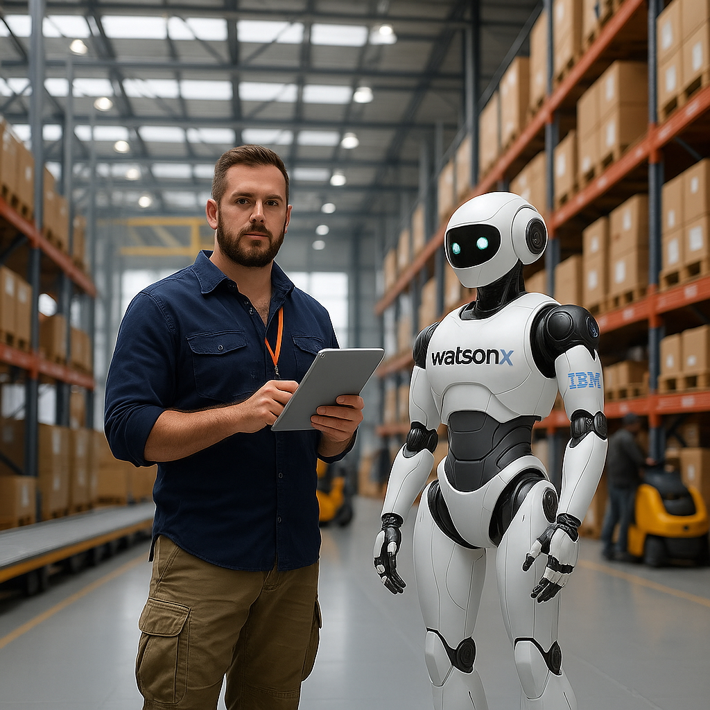

# Akıllı Asistan 

Bu kullanım senaryosu, bir operasyon yöneticisine – daha spesifik olarak bir depo yöneticisine – yardımcı olan bir yapay zeka ajanını konu almaktadır. Yöneticinin sorumluluklarından bazıları, ürün giriş ve çıkışlarını izlemek, envanterin güncel olduğundan emin olmak ve fazla ürünlerin maliyet etkin bir şekilde yönetilmesini sağlamaktır. Bu süreci optimize etmek için watsonx Orchestrate ve watsonx.ai tabanlı ajanik bir çözüm uygulanmaktadır.

## 🤔 Sorun
Bir depo yönetim şirketi olan SmartStorage, manuel süreçler ve tedarik zinciri genelindeki sınırlı görünürlük nedeniyle günlük operasyonlarında önemli zorluklarla karşı karşıyadır. Bu verimsizlikler sevkiyatlarda gecikmelere yol açmakta ve bu da müşteri memnuniyetinde düşüşe neden olmaktadır. Gerçek zamanlı takip ve otomasyon eksikliği, depo yöneticilerinin ürün hareketlerini manuel olarak koordine etmek, depo alanlarının durumunu kontrol etmek ve envanteri yönetmek için önemli miktarda zaman harcamasına neden olmaktadır. Bu durum yalnızca lojistik sürecini yavaşlatmakla kalmaz, aynı zamanda insan hatası riskini artırarak gecikmeleri ve memnuniyetsizliği daha da kötüleştirir. SmartStorage, bu sorunları çözerek operasyonel verimliliğini artırmayı ve hizmet kalitesini iyileştirmeyi hedeflemektedir.

## 🎯 Hedef
Birincil hedef, ürün akışını optimize etmek amacıyla yapay zeka destekli ajanik bir depo yönetim sistemi tasarlamak ve uygulamaktır. Bu sistemin, depo alanlarının durumunu gerçek zamanlı olarak alması ve fazla ürünler için en uygun rotayı bulması öngörülmektedir. Sistemin temel özelliklerinden biri doğal dil arayüzüdür; bu sayede depo yöneticileri sistemle sezgisel bir şekilde sesli veya yazılı komutlarla etkileşim kurarak sevkiyat durumunu sorgulayabilir, envanteri yönetebilir ve gerektiğinde rotaları ayarlayabilir. Ayrıca sistem, kurum içi sistemlerle entegre edilerek veri alışverişinin sorunsuz olmasını sağlayacak ve otomasyondan maksimum fayda elde edilmesini sağlayacaktır. Bu hedefe ulaşılarak SmartStorage, operasyonel verimliliğini artırabilir, maliyetleri düşürebilir ve müşteri memnuniyetini iyileştirebilir.

## 📈 İş Değeri
Yapay zeka destekli ajanik bir depo yönetim sisteminin uygulanması, SmartStorage için önemli iş değerleri sunacaktır. İlk olarak, birçok manuel görevi otomatikleştirerek iş süreçlerini hızlandıracak ve lojistiğin koordine edilmesi için harcanan zamanı azaltacaktır. Bu otomasyon aynı zamanda insan hatası riskini de en aza indirecek, daha güvenilir ve verimli operasyonlar sağlayacaktır. İkinci olarak, sistemin doğal dil arayüzü sezgisel etkileşimlere olanak tanıyacak, depo yöneticilerinin sistemi kullanmasını ve kritik bilgilere gerçek zamanlı olarak erişmesini kolaylaştıracaktır. Son olarak, sistemin tasarımı, yapay zekanın özerkliği ile insan müdahalesi arasında esnek bir denge kurulmasına imkân tanıyacaktır. Böylece yöneticiler gerektiğinde müdahale edebilecek, ancak yapay zekadan gelen verimlilik kazançlarından da faydalanmaya devam edebilecektir. Genel olarak, ajanik yapay zeka çözümü SmartStorage'ın depo yönetim operasyonlarını dönüştürmeye, verimliliği, müşteri memnuniyetini ve nihayetinde kârlılığı artırmaya yönelik güçlü bir adımdır.

## 🏛️ Mimari

## 📄 Adım Adım Uygulamalı Talimatlar
watsonx.ai ve watsonx Orchestrate kullanarak bu kullanım senaryosunu nasıl uygulayabileceğinizi [bu belgede](./Intelligent%20AI%20Assistant.md) adım adım bulabilirsiniz.

